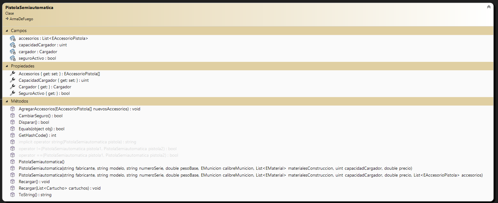
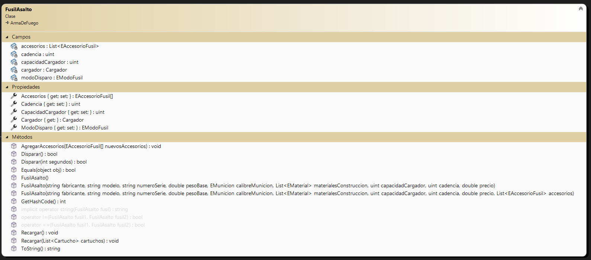

# Armería "Dos tiros de un pájaro"
## Sobre mí
Mi nombre es Juan Pablo Ledezma, tengo 22 años y soy estudiante de la carrera Tecnicatura universitaria en Programación, 
en la Universidad Tecnológica Nacional - Facultad Regional Avellaneda.

Finalicé mi educación secundaria en la E.E.S.T N°7 de Quilmes (IMPA), con el título de Técnico Aviónico.

## Resumen del proyecto
La aplicación es un CRUD básico, el cual consiste en agregar, modificar o eliminar armas de fuego a una armería, 
incluyendo datos como el fabricante, modelo, precio, calibre, etc.
El primer paso para acceder es ingresar los datos de acceso en un formulario login. Si las credenciales son correctas, 
se continúa al formulario principal.

En el formulario principal se pueden agregar armas, modificarlas, eliminarlas, ver su información detallada, ordenar 
los elementos, guardar el estado actual (serialización json o xml), cargar una lista de armas desde un archivo 
(deserialización xml), y visualizar un registro de acciones de usuarios.

Todas las acciones anteriormente mencionadas se pueden realizar desde un menú en la parte superior de la pantalla, 
el cual también muestra información sobre la sesión actual (nombre de usuario y fecha).

## Diagrama de clases
El diagrama de clases es el siguiente:
### Clase Base

### Clases derivadas
Pistola semiautomática

Fusil de asalto

Escopeta de bombeo

Las clases anteriores hacen uso de otras 2 clases: Cartucho y Cargador

