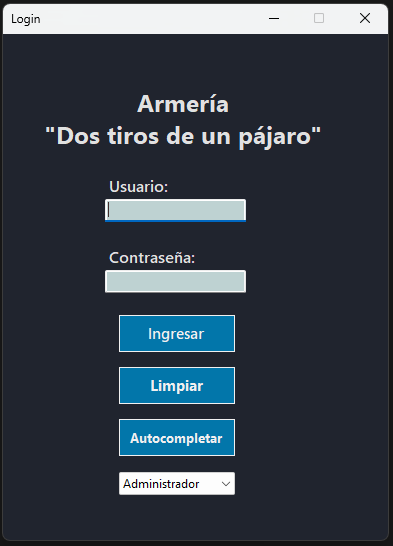
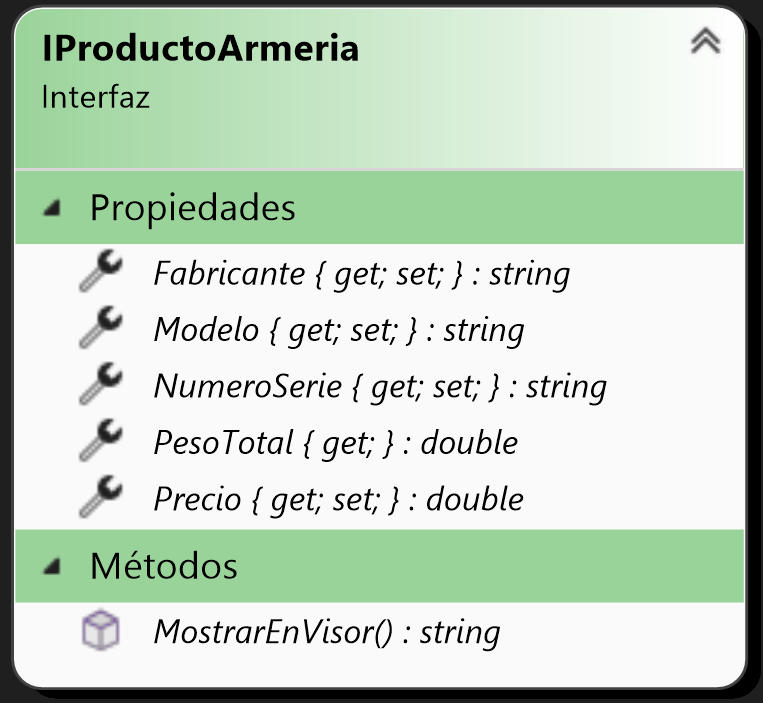

# Armería "Dos tiros de un pájaro"

## Importante
Para esta segunda parte se agregó la manipulación de una base de datos SQL Server. El script SQL para generar la misma se encuentra en este repositorio, en ./armas_db.sql

El script se generó suponiendo que las bases de datos estén almacenadas en C:\SQLData\ ; y los logs en C:\SQLData\Logs\

Si la máquina en la que se ejecute el script tiene una estructura de directorios diferente, el mismo podía no funcionar. Para solucionarlo, hay que modificar manualmente esos directorios en el archivo armas_db.sql (ver imagen anterior).

Una vez dentro del programa CRUD, podría ser necesario modificar la cadena de conexión en caso de que no sea posible conectarse a la base de datos.

La misma se encuentra en ./ADO/Properties/Resources.resx , con el nombre conexionEstandar.

## Sobre mí
Mi nombre es Juan Pablo Ledezma, tengo 22 años y soy estudiante de la carrera Tecnicatura universitaria en Programación, 
en la Universidad Tecnológica Nacional - Facultad Regional Avellaneda.

Finalicé mi educación secundaria en la E.E.S.T N°7 de Quilmes (IMPA), con el título de Técnico Aviónico.

## Resumen del proyecto
La aplicación es un CRUD básico, el cual consiste en agregar, modificar o eliminar armas de fuego a una armería, 
incluyendo datos como el fabricante, modelo, precio, calibre, etc.
El primer paso para acceder es ingresar los datos de acceso en un formulario login. Si las credenciales son correctas, 
se continúa al formulario principal.

En el formulario principal se pueden agregar armas, modificarlas, eliminarlas, ver su información detallada, ordenar 
los elementos, guardar el estado actual (serialización json / xml o desde una base de datos), cargar una lista de armas desde un archivo 
(deserialización xml / base de datos), y visualizar un registro de acciones de usuarios.

Todas las acciones anteriormente mencionadas se pueden realizar desde un menú en la parte superior de la pantalla, 
el cual también muestra información sobre la sesión actual (nombre de usuario y fecha).

### Cambios
En la nueva versión se ordenaron los items del menú para facilitar el acceso al mismo, a la vez que se agregó una barra de estado en la parte inferior de la pantalla.

También se agregaron teclas de acceso rápido (se debe hacer foco sobre el visor para ser utilizadas):

- A - INS : Desplegar el item del menú Armas-Agregar

- Enter - Espacio : Ver los detalles del arma seleccionada

- Suprimir : Eliminar el arma seleccionada (sólo si el perfil es administrador)

- M : Modificar el arma seleccionada (sólo si el perfil es administrador o supervisor)

## Diagrama de clases
El diagrama de clases es el siguiente:
### Clase Base

### Clases derivadas
Pistola semiautomática

Fusil de asalto

Escopeta de bombeo

Las clases anteriores hacen uso de otras 2 clases: Cartucho y Cargador

### Clase contenedora

La jerarquía anterior hace uso de una clase contenedora para agrupar elementos.

Armeria

Dicha clase puede contener cualquier elemento que implemente la interfaz IProductoArmeria

